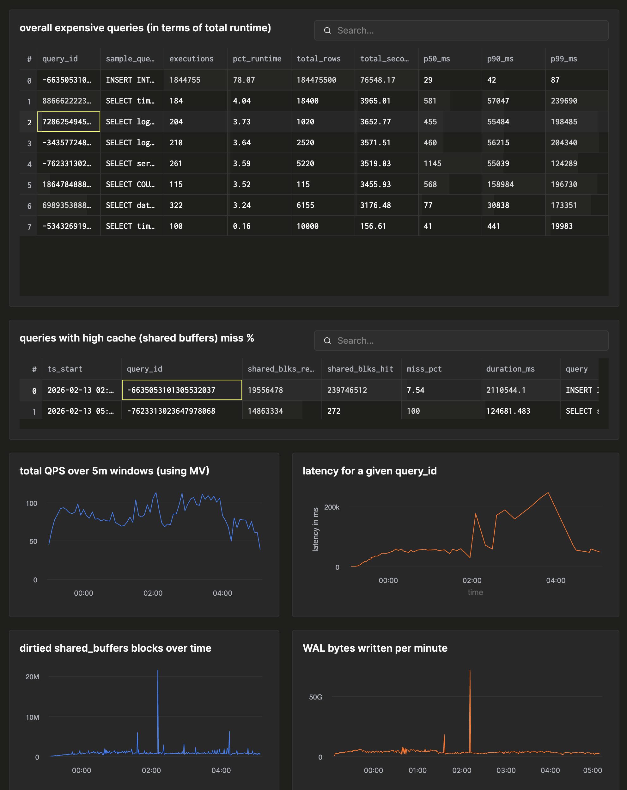

<div align="center">


# pg_stat_ch: PostgreSQL Query Telemetry Exporter to ClickHouse

</div>

A PostgreSQL extension that captures per-query execution telemetry and exports it to ClickHouse in real-time. Unlike pg_stat_statements which aggregates statistics in PostgreSQL, pg_stat_ch exports **raw events** to ClickHouse where aggregation happens via ClickHouse's powerful analytical engine.

## Quickstart

Run local PostgreSQL + ClickHouse with schema preloaded:

```bash
./scripts/quickstart.sh up
./scripts/quickstart.sh check
```

Stop:

```bash
./scripts/quickstart.sh down
```

See [docker/quickstart/README.md](docker/quickstart/README.md) for endpoints and stack details.

## Table of Contents

- [Overview](#overview)
- [Architecture](#architecture)
- [Features](#features)
- [Supported Versions](#supported-versions)
- [Building from Source](#building-from-source)
- [Installation](#installation)
- [Recommended PostgreSQL Settings](#recommended-postgresql-settings)
- [Configuration](#configuration)
- [SQL API](#sql-api)
- [Example Queries](#example-queries)
- [Testing](#testing)
- [Troubleshooting](#troubleshooting)
- [License](#license)

## Overview

<div align="center">

<a href="images/dashboard.png"></a>

</div>

pg_stat_ch captures detailed telemetry for every query executed in PostgreSQL and exports it to ClickHouse via a single data pipeline:

```
PostgreSQL Hooks (foreground) → Shared Memory Queue → Background Worker → ClickHouse
```

**Key design principles:**
- **Zero network I/O on query path** - Events are queued in shared memory, not sent synchronously
- **Raw events, not aggregates** - All aggregation (p50/p95/p99, top queries, errors) happens in ClickHouse
- **Bounded memory** - Fixed-size ring buffer with overflow counters; dropped events don't block queries
- **Minimal overhead** - ~5μs p99 overhead per captured statement

## Architecture

### Data Flow

1. **PostgreSQL Hooks** capture query start/end with full instrumentation
2. **Shared Memory Ring Buffer** stores events (MPSC: multi-producer, single-consumer)
3. **Background Worker** dequeues batches and exports to ClickHouse
4. **ClickHouse** stores raw events in `events_raw` table; views/MVs provide aggregates

## Features

- **Full Query Telemetry**: Timing, row counts, buffer usage, WAL usage, CPU time
- **All Statement Types**: DML (SELECT/INSERT/UPDATE/DELETE/MERGE), DDL, utility statements
- **Error Capture**: SQLSTATE codes and error levels via emit_log_hook
- **JIT Instrumentation** (PG15+): Function count, generation/inlining/optimization/emission time
- **Parallel Worker Stats** (PG18+): Planned vs launched workers
- **Client Context**: Application name, client IP address
- **Query Text**: Captured with truncation (2KB max)
- **Graceful Degradation**: Queue overflow drops events with counters; ClickHouse unavailability doesn't block PostgreSQL

## Supported Versions

PostgreSQL 16, 17, and 18 are fully supported. See [docs/version-compatibility.md](docs/version-compatibility.md) for the feature matrix and version-specific fields.

## Building from Source

Prerequisites:

- CMake 3.16+, C++17 compiler (GCC 9+, Clang 10+)
- PostgreSQL 16+ development headers
- [mise](https://mise.jdx.dev/) (recommended) or manual PostgreSQL installation

[clickhouse-cpp](https://github.com/ClickHouse/clickhouse-cpp) is vendored as a submodule and statically linked.

```bash
git submodule update --init --recursive

# Using mise (recommended)
mise run build              # Debug build (use build:16/17/18 for specific versions)
mise run build:release      # Release build
mise run install            # Install the extension

# Or manually
cmake -B build -G Ninja -DPG_CONFIG=/path/to/pg_config
cmake --build build && cmake --install build
```

## Installation

### 1. Configure PostgreSQL

Add to `postgresql.conf`:

```ini
shared_preload_libraries = 'pg_stat_ch'
track_io_timing = on   # Enables I/O timing columns for captured events

# ClickHouse connection (change for your setup)
pg_stat_ch.clickhouse_host = 'localhost'
pg_stat_ch.clickhouse_port = 9000
pg_stat_ch.clickhouse_database = 'pg_stat_ch'

# TLS (recommended for production)
pg_stat_ch.clickhouse_use_tls = on
pg_stat_ch.clickhouse_skip_tls_verify = off
```

### 2. Restart PostgreSQL

```bash
# Restart PostgreSQL using your service manager (systemd, brew services, Docker, etc.)
```

### 3. Set Up Schema on ClickHouse

Quickstart path: run `./scripts/quickstart.sh up` and schema setup is handled automatically.

Manual / existing ClickHouse paths:

```bash
clickhouse-client < docker/init/00-schema.sql
```

Creates `events_raw` plus materialized views. See [docs/clickhouse.md](docs/clickhouse.md) for full schema details.

### 4. Create the Extension

```sql
CREATE EXTENSION pg_stat_ch;
```

### 5. Verify

```sql
SELECT pg_stat_ch_version();
SELECT * FROM pg_stat_ch_stats();
```

## Configuration

### GUC Variables

| Parameter | Type | Default | Reload | Description |
|-----------|------|---------|--------|-------------|
| `pg_stat_ch.enabled` | bool | `on` | SIGHUP | Enable/disable telemetry collection |
| `pg_stat_ch.clickhouse_host` | string | `localhost` | Restart | ClickHouse server hostname |
| `pg_stat_ch.clickhouse_port` | int | `9000` | Restart | ClickHouse native protocol port |
| `pg_stat_ch.clickhouse_user` | string | `default` | Restart | ClickHouse username |
| `pg_stat_ch.clickhouse_password` | string | `""` | Restart | ClickHouse password |
| `pg_stat_ch.clickhouse_database` | string | `pg_stat_ch` | Restart | ClickHouse database name |
| `pg_stat_ch.queue_capacity` | int | `65536` | Restart | Ring buffer size (must be power of 2) |
| `pg_stat_ch.flush_interval_ms` | int | `1000` | SIGHUP | Export batch interval in milliseconds |
| `pg_stat_ch.batch_max` | int | `10000` | SIGHUP | Maximum events per ClickHouse insert |
| `pg_stat_ch.clickhouse_use_tls` | bool | `off` | Restart | Enable TLS for ClickHouse connections |
| `pg_stat_ch.clickhouse_skip_tls_verify` | bool | `off` | Restart | Skip TLS certificate verification (insecure) |
| `pg_stat_ch.log_min_elevel` | enum | `warning` | Superuser | Minimum error level to capture (debug5..panic) |

See [Error Level Values](docs/version-compatibility.md#error-fields) for the complete list of error levels and their numeric values in ClickHouse.

## SQL API

| Function | Description |
|----------|-------------|
| `pg_stat_ch_version()` | Returns extension version string |
| `pg_stat_ch_stats()` | Queue and exporter statistics ([column details](docs/troubleshooting.md#sql-api-reference)) |
| `pg_stat_ch_reset()` | Reset all queue counters to zero |
| `pg_stat_ch_flush()` | Trigger immediate flush of queued events to ClickHouse |

## Example Queries

Raw per-execution events enable percentiles, time-series, and per-app drill-downs:

```sql
-- Slowest queries for a specific application, with percentiles
SELECT query_id,
       count() AS calls,
       quantile(0.95)(duration_us) / 1000 AS p95_ms,
       quantile(0.99)(duration_us) / 1000 AS p99_ms
FROM pg_stat_ch.events_raw
WHERE app = 'myapp'
  AND ts_start > now() - INTERVAL 1 HOUR
GROUP BY query_id
ORDER BY p99_ms DESC
LIMIT 10;
```

See [docs/clickhouse.md](docs/clickhouse.md) for materialized view definitions and more query examples.

## Testing

```bash
mise run test:all                          # Run all tests
mise run test:regress                      # SQL regression tests only
./scripts/run-tests.sh 18 all             # Specific PG version
./scripts/run-tests.sh ../postgres/install_tap tap  # TAP tests with local PG build
```

See [docs/testing.md](docs/testing.md) for test types, TAP test setup, and a full listing of test files.

## Troubleshooting

Common issues: extension not loading (check `shared_preload_libraries`), events not appearing (check `pg_stat_ch_stats()` for errors), high queue usage or dropped events (tune `pg_stat_ch.queue_capacity`, `pg_stat_ch.flush_interval_ms`, `pg_stat_ch.batch_max`).

See [docs/troubleshooting.md](docs/troubleshooting.md) for detailed solutions.

## License

This project is licensed under the Apache License, Version 2.0. See [LICENSE.md](LICENSE.md) for the full license text.
