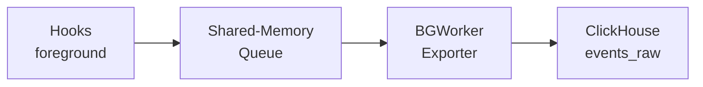

A PostgreSQL 16+ extension that captures query execution telemetry via server hooks and exports it to ClickHouse.

## How it works

The extension hooks into PostgreSQL's query lifecycle to collect timing, row counts, and error data. Events are written to a lock-free shared-memory ring buffer and flushed to ClickHouse by a background worker.

All aggregation (p50/p95/p99, top queries, errors) happens in ClickHouse via materialized views — not in the extension.

## Features

- **Zero-copy capture** — hooks write directly into shared memory with no heap allocation
- **Background export** — a background worker drains the queue and batches inserts to ClickHouse
- **ClickHouse aggregation** — materialized views handle percentiles, top-N, and error rollups
- **Multi-version support** — works with PostgreSQL 16, 17, and 18

## Next steps

Head to the [Quick Start](/get-started/quick-start) guide to get up and running.
