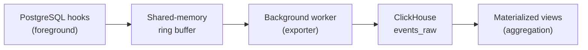

pg_stat_ch is a PostgreSQL extension that captures per-execution query telemetry and exports it to ClickHouse. Every query execution becomes a row in ClickHouse with timing, buffer usage, WAL activity, CPU time, JIT stats, error details, and client context.

## Why pg_stat_ch

PostgreSQL ships with `pg_stat_statements`, which aggregates query statistics in shared memory. It answers "how does this query perform on average?" but cannot answer:

- **When did it get slow?** Cumulative counters hide time-series trends. You can't see a latency spike that started 10 minutes ago.
- **What happened during that one slow execution?** Averages smooth over outliers. A single 30-second query disappears into a mean of 5ms.
- **Which application or user caused the load?** `pg_stat_statements` groups by query text, not by client.
- **What errors are happening and when?** Error tracking is not part of `pg_stat_statements`.

pg_stat_ch solves this by exporting raw, per-execution events to ClickHouse, where you can slice and aggregate the data however you need.

| | pg_stat_statements | pg_stat_ch |
|---|---|---|
| **Granularity** | Cumulative per query | Per execution |
| **Time-series** | No (counters only) | Yes (timestamped events) |
| **Percentiles** | No | p50/p95/p99 via ClickHouse |
| **Error tracking** | No | SQLSTATE, error level, message |
| **Client attribution** | No | Application name, client IP |
| **Storage** | PostgreSQL shared memory | ClickHouse (compressed, scalable) |
| **Retention** | Resets on restart | Days, weeks, or longer |
| **Query overhead** | ~1-2 us | ~5 us p99 |

## Architecture

1. **Hooks** capture query telemetry in the foreground path. The extension hooks into `ExecutorStart`, `ExecutorRun`, `ExecutorFinish`, `ExecutorEnd`, `ProcessUtility`, and `emit_log` to collect timing, buffer stats, WAL usage, CPU time, JIT metrics, errors, and client context.

2. **Shared-memory ring buffer** receives events with no network I/O on the query path. The buffer uses a multi-producer, single-consumer (MPSC) design with batched writes.

3. **Background worker** drains the ring buffer and inserts events to ClickHouse in batches. It runs on a configurable interval (default 200ms) with automatic retry and exponential backoff.

4. **ClickHouse materialized views** handle all aggregation. Pre-built views provide 5-minute query stats with percentiles, per-application load breakdowns, and error feeds. You can add your own views for custom analytics.

## What it captures

Every query execution produces an event with these fields:

| Category | Fields | Notes |
|---|---|---|
| **Timing** | `ts_start`, `duration_us` | Microsecond precision |
| **Identity** | `db`, `username`, `pid`, `query_id`, `cmd_type` | `query_id` groups normalized queries |
| **Results** | `rows`, `query` | Query text truncated to 2 KB |
| **Shared buffers** | `shared_blks_hit/read/dirtied/written` | Cache hit ratio |
| **Local buffers** | `local_blks_hit/read/dirtied/written` | Temp table I/O |
| **Temp files** | `temp_blks_read/written` | `work_mem` pressure |
| **I/O timing** | `shared/local/temp_blk_read/write_time_us` | Requires `track_io_timing=on` |
| **WAL** | `wal_records`, `wal_fpi`, `wal_bytes` | Write-ahead log activity |
| **CPU** | `cpu_user_time_us`, `cpu_sys_time_us` | User vs kernel time |
| **JIT** | `jit_functions`, `jit_*_time_us` | JIT compilation overhead (PG 15+) |
| **Parallel** | `parallel_workers_planned/launched` | Worker efficiency (PG 18+) |
| **Errors** | `err_sqlstate`, `err_elevel`, `err_message` | SQLSTATE code and severity |
| **Client** | `app`, `client_addr` | Load attribution |

See the [events schema reference](/reference/events-schema) for the full field list with types and tuning guidance.

## Supported versions

- PostgreSQL 16, 17, and 18
- ClickHouse (any recent version) or OpenTelemetry-compatible collectors

Newer PostgreSQL versions expose additional metrics. See [version compatibility](/reference/version-compatibility) for the feature matrix.

## Next steps

<CardGroup cols={2}>
  <Card title="Installation" icon="download" href="/get-started/installation">
    Build from source and load the extension
  </Card>
  <Card title="Quick start" icon="bolt" href="/get-started/quick-start">
    End-to-end setup in 5 minutes with Docker
  </Card>
</CardGroup>
